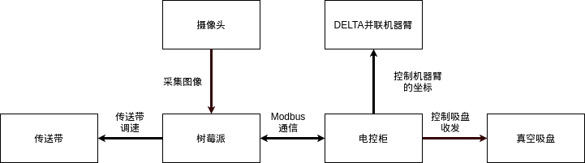
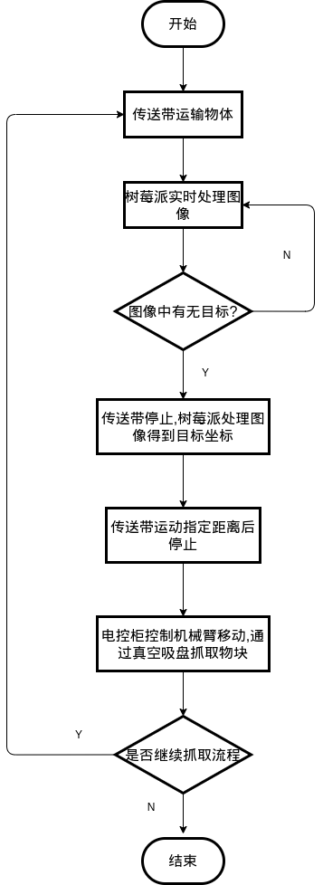
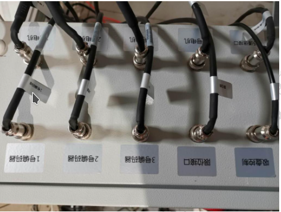
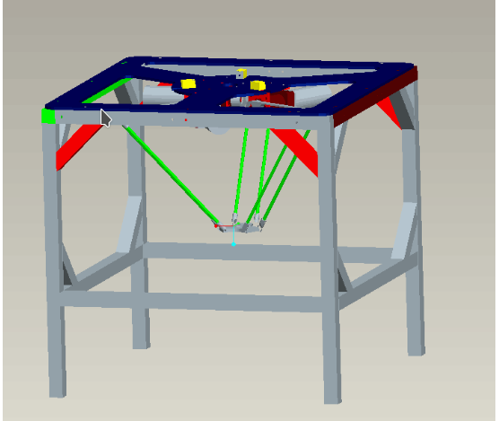
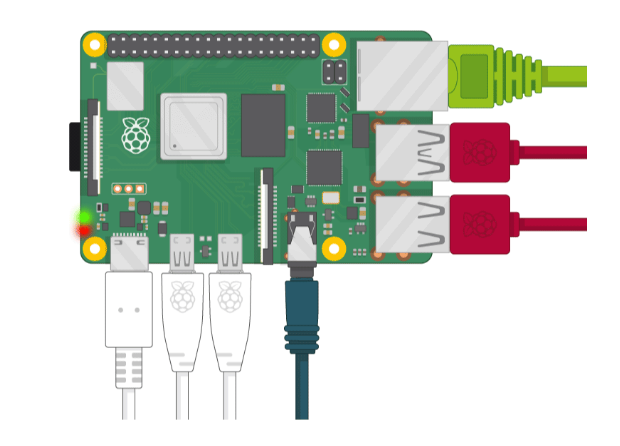
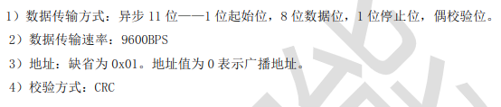
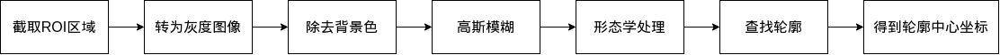

# DELTA 机器人传送带抓取装置

- [DELTA 机器人传送带抓取装置](#delta-机器人传送带抓取装置)
  - [设备总体设计方案](#设备总体设计方案)
    - [总体结构概述](#总体结构概述)
    - [整体流程](#整体流程)
  - [硬件设计](#硬件设计)
    - [机械结构](#机械结构)
    - [硬件电路](#硬件电路)
  - [软件设计](#软件设计)
    - [DELTA 机器人控制程序](#delta-机器人控制程序)
    - [图像处理程序](#图像处理程序)
    - [传送带控制程序](#传送带控制程序)

## 设备总体设计方案

### 总体结构概述

本作品由DELTA 机器人模块和图像处理模块,传送带模块组成, 控制核心由控制机器臂的电控柜和负责图像处理以及控制传送带的树莓派构成.摄像头负责采集图像数据,传送带负责运输目标,并联机器臂移动到目标坐标,真空吸盘负责抓取物块.

作品的硬件框图如下:



### 整体流程

整体流程为:摄像头实时采集图像数据,树莓派对图像数据进行处理.当捕获到目标时,树莓派控制传送带停止运动,并实时捕获目标所在的图像坐标.将图像坐标与机械臂坐标进行转换,得到传送带运动的距离.树莓派控制传送带运动到相应位置,停止传送带的运动,发送坐标数据给电控柜.电控柜控制并联机器臂运动到相应位置,然后控制真空吸盘进行抓取.



## 硬件设计

### 机械结构

本作品的机械结构主要由 DELTA 机器人和传送带构成. DELTA 机器人有铝质框架,电控柜,并联机器臂,以及真空吸盘构成.

电控柜通过 modbus 协议与外部控制板(可以是笔记本电脑,单片机,树莓派,PLC等)通信,进而控制并联机械臂和真空吸盘.其中,真空吸盘外接真空发生器,电磁阀,空气压缩机.控制过程为电控柜控制电磁阀开断,电磁阀控制空气压缩机进气,气体通过真空发生器对真空吸盘抽气.

DELTA 机器人整体结构和电控柜如下所示.可以参考[安装说明链接](资料/安装说明.pdf)





传送带则是直接通过树莓派控制速度和启停.

### 硬件电路

本作品的硬件较为简单,主要是树莓派和采集数据的usb摄像头,以及 DELTA 机器人的电控柜组成.

树莓派直接通过usb连接摄像头,通过usb转485模块和电控柜连接.



## 软件设计

### DELTA 机器人控制程序

DELTA 机器人的控制是通过电控柜与树莓派通信,其中使用了modbus协议,[详细协议链接](./资料/通信协议四轴.pdf).

树莓派和 opencv 环境搭建可以参考我的[博客](https://blog.csdn.net/sanxml),或者我的 [github](https://github.com/sanxml/learn/blob/master/SUMMARY.md)

下面介绍如何使用 python 程序实现与电控柜的通信,这里使用了 serial 内置串口通信库,根据 DELTA 机器人的通信协议可知,需要设置传输方式和波特率.



``` python
'''并联机器人通信示例程序'''
import serial
# 设置串口,第一个参数为连接的端口,windows系统可能为 'com1'
# 第二个参数为波特率
# 最后三个参数分别代表 8位数据位 偶校验位 1位停止位
ser = serial.Serial('/dev/ttyUSB1',9600,8,'E',1)
```

接下来是数据收发过程,详细的可以查看[示例程序链接](code/example/read_and_write.py)

从通信协议可以看出,发送数据和接受数据末尾四位数都是通过CRC检验得到的,这里使用了 crcmod 的库,需要通过pip下载.打开终端

``` shell
pip install crcmod
```

crc16/modbus的[示例程序链接](code/example/crc_check.py)

通过树莓派控制 DELTA 机器人的[程序链接](code/control.py)

### 图像处理程序

需要先搭建 opencv-python 环境,根据上一节已经搭建好了.下面介绍图像处理的整体思路.

首先对采集的图像进行截取 ROI(感兴趣) 区域,这里的 ROI 区域就是传送带的区域.再将图像转成灰度图像,使用阈值处理除去背景色并转为二值化图像.将二值化图高斯模糊降噪,以及形态学处理去除毛边等.使用opencv内置的查找轮廓函数,查找较大轮廓.最后是对轮廓点进行分析,得到坐标值.



### 传送带控制程序

待补充...
