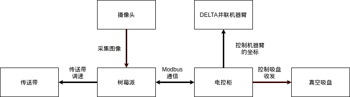
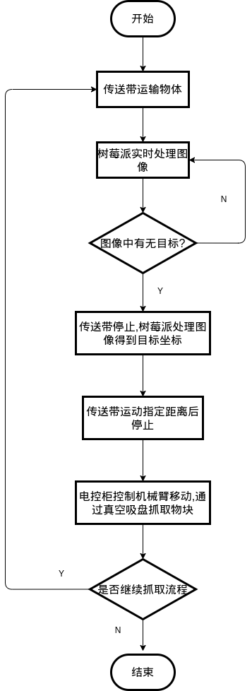

# DELTA 并联机器臂传送带抓取装置

- [DELTA 并联机器臂传送带抓取装置](#delta-并联机器臂传送带抓取装置)
  - [设备总体设计方案](#设备总体设计方案)
    - [总体结构概述](#总体结构概述)
    - [整体流程](#整体流程)
  - [硬件设计](#硬件设计)
    - [机械结构](#机械结构)
    - [硬件电路](#硬件电路)
  - [软件设计](#软件设计)
    - [机械臂控制程序](#机械臂控制程序)
    - [图像处理程序](#图像处理程序)
    - [传送带控制程序](#传送带控制程序)

## 设备总体设计方案

### 总体结构概述

本作品由 DELTA 并联机器臂模块和图像处理模块,传送带模块组成, 控制核心由控制机器臂的电控柜和负责图像处理以及控制传送带的树莓派构成.摄像头负责采集图像数据,传送带负责运输目标,DELTA 并联机器臂移动到目标坐标,真空吸盘负责抓取物块.

作品的硬件框图如下:

### 整体流程

整体流程为:摄像头实时采集图像数据,树莓派对图像数据进行处理.当捕获到目标时,树莓派控制传送带停止运动,并实时捕获目标所在的图像坐标.将图像坐标与机械臂坐标进行转换,得到传送带运动的距离.树莓派控制传送带运动到相应位置,停止传送带的运动,发送坐标数据给电控柜.电控柜控制并联机器臂运动到相应位置,然后控制真空吸盘进行抓取.

## 硬件设计

### 机械结构

### 硬件电路

## 软件设计

### 机械臂控制程序

### 图像处理程序

### 传送带控制程序